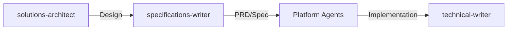
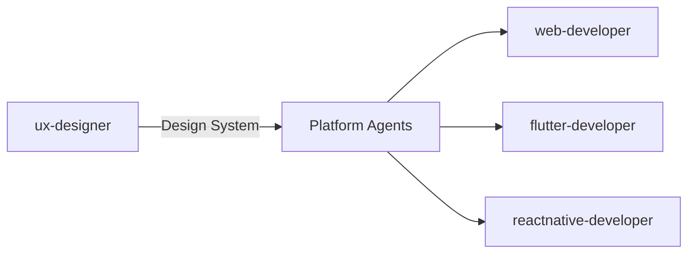
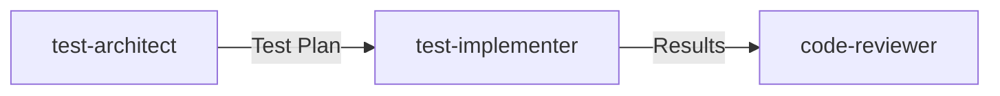

# Prometheus Agents 🚀

**Version: 0.4.1**

A comprehensive collection of specialized Claude SubAgents designed for software architecture, development, and engineering workflows. Each agent is expertly crafted with domain-specific knowledge to assist with different aspects of the software development lifecycle.

## Overview

Prometheus Agents provides 23 specialized AI agents that work together to handle complex software engineering tasks. From system architecture to implementation, testing to documentation, security to project management, these agents cover the full spectrum of modern software development.

## 🎯 Key Features

- **23 Specialized Agents** across 6 categories
- **Domain Expertise** - Each agent has deep knowledge in their specific area
- **Opus Model Support** - 6 agents optimized for Opus when complex reasoning is needed
- **Collaborative Workflows** - Agents work together for complex tasks
- **Framework Support** - Specialized for Elixir/Phoenix (Ash Framework), Flutter (GetX), React Native, SvelteKit
- **Color-Coded Categories** - Visual organization for quick agent selection

## 🤖 Agent Categories

### 🔵 Backend & Architecture (8 agents)
- **[brainstormer](agents/brainstormer.md)** - Creative ideation, technology exploration *(defaults to Opus)*
- **[solutions-architect](agents/solutions-architect.md)** - System design, patterns, cloud architecture *(defaults to Opus)*
- **[specifications-writer](agents/specifications-writer.md)** - PRDs, technical specs, implementation plans
- **[elixir-developer](agents/elixir-developer.md)** - Elixir/Phoenix with Ash Framework
- **[database-specialist](agents/database-specialist.md)** - PostgreSQL, Ash/Ecto optimization *(defaults to Opus)*
- **[data-architect](agents/data-architect.md)** - Database design, data modeling, ETL/ELT
- **[ontology-specialist](agents/ontology-specialist.md)** - RDF, SPARQL, OWL, schema.org
- **[devops-engineer](agents/devops-engineer.md)** - AWS, Terraform, GitHub Actions, CI/CD

### 🟢 UI/UX Development (5 agents)
- **[ux-designer](agents/ux-designer.md)** - Master UX/UI coordinator, design systems
- **[web-developer](agents/web-developer.md)** - HTML, JavaScript, TailwindCSS for Phoenix
- **[sveltekit-developer](agents/sveltekit-developer.md)** - SvelteKit and Svelte applications
- **[flutter-developer](agents/flutter-developer.md)** - Flutter with GetX state management
- **[reactnative-developer](agents/reactnative-developer.md)** - React Native cross-platform apps

### 🟣 Testing & Quality (3 agents)
- **[test-architect](agents/test-architect.md)** - Test planning, strategy *(defaults to Opus)*
- **[test-implementer](agents/test-implementer.md)** - Test implementation across all platforms
- **[code-reviewer](agents/code-reviewer.md)** - Static analysis, linting, warnings

### 🔷 API Development (3 agents)
- **[api-designer](agents/api-designer.md)** - REST API design, OpenAPI specifications
- **[api-implementer](agents/api-implementer.md)** - Phoenix API with Ash Framework
- **[api-documenter](agents/api-documenter.md)** - API documentation, integration guides

### 🔘 Documentation (1 agent)
- **[technical-writer](agents/technical-writer.md)** - Technical docs, guides, ADRs

### 🟠 Operations & Management (3 agents)
- **[security-specialist](agents/security-specialist.md)** - Application security, OWASP *(defaults to Opus)*
- **[performance-optimizer](agents/performance-optimizer.md)** - Performance profiling, optimization *(defaults to Opus)*
- **[project-coordinator](agents/project-coordinator.md)** - Agile management, sprint planning

## 🚀 Quick Start

### Installation

Install the agents into Claude's agent directories:

#### Option 1: Project-Level Installation (Recommended for specific projects)
```bash
# From your project root, create the Claude agents directory
mkdir -p .claude/agents

# Copy all agents to your project
cp agents/*.md .claude/agents/
```

#### Option 2: User-Level Installation (Available across all projects)
```bash
# Copy to your home Claude directory
mkdir -p ~/.claude/agents
cp agents/*.md ~/.claude/agents/
```

> **Note**: Project-level agents (`.claude/agents/`) take precedence over user-level agents when names conflict.

### Using an Agent

Once installed, reference agents using the `@` symbol followed by the agent filename:
```
@elixir-developer - for Elixir/Phoenix development
@flutter-developer - for Flutter mobile apps
@specifications-writer - for PRDs and tech specs
```

### Example Workflows

#### Building a New Feature
```
1. @solutions-architect - Design the architecture
2. @specifications-writer - Write PRD and tech spec
3. @api-designer - Design the API
4. @ux-designer - Create UI mockups
5. @elixir-developer - Implement backend
6. @flutter-developer - Build mobile UI
7. @test-architect - Create test plan
8. @technical-writer - Document the feature
```

#### Code Quality Review
```
1. @code-reviewer - Analyze warnings and issues
2. @elixir-developer - Fix Elixir/Credo warnings
3. @test-implementer - Add missing tests
```

## 📁 Project Structure

```
prometheus-agents/
├── agents/                    # Agent implementations (23 agents)
│   ├── solutions-architect.md
│   ├── specifications-writer.md
│   └── ... (21 more agents)
├── docs/                      # Documentation
│   ├── AGENT_DEVELOPMENT_PLAN.md
│   ├── AGENT_SUMMARY.md
│   └── AGENT_USAGE_GUIDE.md
├── rules/                     # Framework usage rules
│   ├── ash.md
│   ├── ash_phoenix.md
│   ├── elixir_usage.md
│   └── ... (more rules)
├── CLAUDE.md                  # Project configuration
└── README.md                  # This file
```

## 🔧 Technology Stack

### Backend
- **Elixir/Phoenix** with **Ash Framework** (not Ecto)
- **PostgreSQL** with AshPostgres
- **REST APIs** with AshJsonApi

### Frontend
- **Phoenix LiveView** with TailwindCSS
- **SvelteKit** for full-stack JavaScript
- **Flutter** with GetX state management
- **React Native** with Expo

### Testing
- **ExUnit** for Elixir
- **Jest/Vitest** for JavaScript
- **Flutter Test Framework**
- **React Native Testing Library**

### Quality Tools
- **Credo** for Elixir
- **ESLint** for JavaScript/TypeScript
- **Dart Analyzer** for Flutter

## 📚 Documentation

- **[CLAUDE.md](CLAUDE.md)** - Main project configuration and overview
- **[Development Plan](docs/AGENT_DEVELOPMENT_PLAN.md)** - Comprehensive development roadmap
- **[Agent Summary](docs/AGENT_SUMMARY.md)** - Complete overview of all 23 agents
- **[Usage Guide](docs/AGENT_USAGE_GUIDE.md)** - Detailed guide for using agents

## 🤝 Agent Collaboration Patterns

### Specification Development Flow


### UI/UX Development Flow


### Testing Workflow


## 🎨 Agent Color Legend

- 🔵 **Blue (#2196F3)** - Backend & Architecture
- 🟢 **Green (#4CAF50)** - UI/UX Development
- 🟣 **Purple (#9C27B0)** - Testing & Quality
- 🔷 **Cyan (#00BCD4)** - API Development
- 🔘 **Blue-Grey (#607D8B)** - Documentation
- 🟠 **Deep Orange (#FF5722)** - Operations & Management

## 👤 User Context

This project is designed for:
- Software Solutions Architects
- Elixir Phoenix Engineers
- Data Architects specializing in:
  - Data schema design
  - Enterprise data flows
  - Semantic data (RDF, SPARQL, OWL)
- Full-stack developers working across multiple platforms

## 🚦 Getting Started

1. **Choose the right agent** - Use the color coding and descriptions to select
2. **Provide context** - Share relevant code, specs, or requirements
3. **Chain agents** - Use multiple agents for complex workflows
4. **Follow patterns** - Leverage established collaboration patterns

## 📖 Usage Rules

The project includes comprehensive usage rules for:
- Elixir/OTP best practices
- Ash Framework patterns
- Memory management
- MCP (Model Context Protocol)

See the [rules/](rules/) directory for detailed guidelines.

## 🛠️ Development Principles

- **Specialization** - Each agent excels at specific tasks
- **Collaboration** - Agents work together seamlessly
- **Best Practices** - Following framework and language conventions
- **User-Focused** - Clear documentation and usage guidance

## 📝 License

This project is licensed under the MIT License - see below:

```
MIT License

Copyright (c) 2025 Terry Lee

Permission is hereby granted, free of charge, to any person obtaining a copy
of this software and associated documentation files (the "Software"), to deal
in the Software without restriction, including without limitation the rights
to use, copy, modify, merge, publish, distribute, sublicense, and/or sell
copies of the Software, and to permit persons to whom the Software is
furnished to do so, subject to the following conditions:

The above copyright notice and this permission notice shall be included in all
copies or substantial portions of the Software.

THE SOFTWARE IS PROVIDED "AS IS", WITHOUT WARRANTY OF ANY KIND, EXPRESS OR
IMPLIED, INCLUDING BUT NOT LIMITED TO THE WARRANTIES OF MERCHANTABILITY,
FITNESS FOR A PARTICULAR PURPOSE AND NONINFRINGEMENT. IN NO EVENT SHALL THE
AUTHORS OR COPYRIGHT HOLDERS BE LIABLE FOR ANY CLAIM, DAMAGES OR OTHER
LIABILITY, WHETHER IN AN ACTION OF CONTRACT, TORT OR OTHERWISE, ARISING FROM,
OUT OF OR IN CONNECTION WITH THE SOFTWARE OR THE USE OR OTHER DEALINGS IN THE
SOFTWARE.
```

## 🌟 Community

Built with ❤️ for the **Claude** and **Elixir** communities by a software solutions architect who believes in the tactical power of ethical self-sovereign data engineering.

## 👨‍💻 Author

**Terry Lee**
- LinkedIn: [https://www.linkedin.com/in/terryleesingapore/](https://www.linkedin.com/in/terryleesingapore/)
- GitHub: [https://github.com/mudspot](https://github.com/mudspot)

---

_Empowering developers with intelligent, specialized AI agents for modern ethical software engineering._
