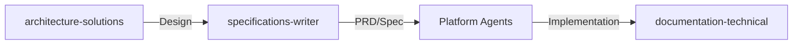
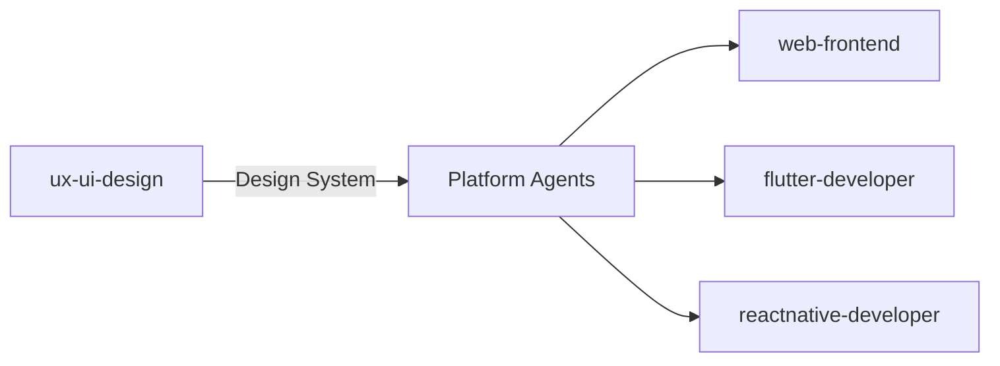
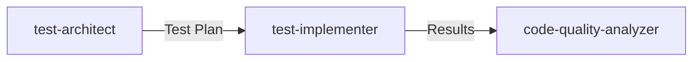

# Prometheus Agents 🚀

**Version: 0.1.0**

A comprehensive collection of specialized Claude SubAgents designed for software architecture, development, and engineering workflows. Each agent is expertly crafted with domain-specific knowledge to assist with different aspects of the software development lifecycle.

## Overview

Prometheus Agents provides 17 specialized AI agents that work together to handle complex software engineering tasks. From system architecture to implementation, testing to documentation, these agents cover the full spectrum of modern software development.

## 🎯 Key Features

- **17 Specialized Agents** across 6 categories
- **Domain Expertise** - Each agent has deep knowledge in their specific area
- **Collaborative Workflows** - Agents work together for complex tasks
- **Framework Support** - Specialized for Elixir/Phoenix (Ash Framework), Flutter (GetX), React Native, SvelteKit
- **Color-Coded Categories** - Visual organization for quick agent selection

## 🤖 Agent Categories

### 🔵 Architecture & Solutioning
- **[architecture-solutions](agents/architecture-solutions.md)** - System design, patterns, cloud architecture, C4 diagrams
- **[specifications-writer](agents/specifications-writer.md)** - PRDs, technical specs, implementation plans

### 🟢 Backend Development
- **[elixir-phoenix](agents/elixir-phoenix.md)** - Elixir/Phoenix with Ash Framework (not Ecto)
- **[data-architecture](agents/data-architecture.md)** - Database design, data modeling, ETL/ELT
- **[semantic-data](agents/semantic-data.md)** - RDF, SPARQL, OWL, FOAF, schema.org

### 🟠 UI/UX Development
- **[ux-ui-design](agents/ux-ui-design.md)** - Master UX/UI coordinator, design systems
- **[web-frontend](agents/web-frontend.md)** - HTML, JavaScript, TailwindCSS for Phoenix
- **[sveltekit-developer](agents/sveltekit-developer.md)** - SvelteKit and Svelte applications
- **[flutter-developer](agents/flutter-developer.md)** - Flutter with GetX state management
- **[reactnative-developer](agents/reactnative-developer.md)** - React Native cross-platform apps

### 🟣 Testing & Quality
- **[test-architect](agents/test-architect.md)** - Test planning, strategy, stub generation
- **[test-implementer](agents/test-implementer.md)** - Test implementation across all platforms
- **[code-quality-analyzer](agents/code-quality-analyzer.md)** - Static analysis, linting, warnings

### 🟦 API Development
- **[api-designer](agents/api-designer.md)** - REST API design, OpenAPI specifications
- **[api-implementer](agents/api-implementer.md)** - Phoenix API with Ash Framework
- **[api-documenter](agents/api-documenter.md)** - API documentation, integration guides

### 🟪 Documentation
- **[documentation-technical](agents/documentation-technical.md)** - Technical docs, guides, ADRs

## 🚀 Quick Start

### Installation

Install the agents into Claude's agent directories:

#### Option 1: Project-Level Installation (Recommended for specific projects)
```bash
# From your project root, create the Claude agents directory
mkdir -p .claude/agents

# Copy all agents to your project
cp agents/*.md .claude/agents/
```

#### Option 2: User-Level Installation (Available across all projects)
```bash
# Copy to your home Claude directory
mkdir -p ~/.claude/agents
cp agents/*.md ~/.claude/agents/
```

> **Note**: Project-level agents (`.claude/agents/`) take precedence over user-level agents when names conflict.

### Using an Agent

Once installed, reference agents using the `@` symbol followed by the agent filename:
```
@elixir-phoenix - for Elixir/Phoenix development
@flutter-developer - for Flutter mobile apps
@specifications-writer - for PRDs and tech specs
```

### Example Workflows

#### Building a New Feature
```
1. @architecture-solutions - Design the architecture
2. @specifications-writer - Write PRD and tech spec
3. @api-designer - Design the API
4. @ux-ui-design - Create UI mockups
5. @elixir-phoenix - Implement backend
6. @flutter-developer - Build mobile UI
7. @test-architect - Create test plan
8. @documentation-technical - Document the feature
```

#### Code Quality Review
```
1. @code-quality-analyzer - Analyze warnings and issues
2. @elixir-phoenix - Fix Elixir/Credo warnings
3. @test-implementer - Add missing tests
```

## 📁 Project Structure

```
prometheus-agents/
├── agents/                    # Agent implementations
│   ├── architecture-solutions.md
│   ├── specifications-writer.md
│   └── ... (15 more agents)
├── docs/                      # Documentation
│   ├── AGENT_DEVELOPMENT_PLAN.md
│   └── AGENT_USAGE_GUIDE.md
├── rules/                     # Framework usage rules
│   ├── ash.md
│   ├── ash_phoenix.md
│   ├── elixir_usage.md
│   └── ... (more rules)
├── CLAUDE.md                  # Project configuration
└── README.md                  # This file
```

## 🔧 Technology Stack

### Backend
- **Elixir/Phoenix** with **Ash Framework** (not Ecto)
- **PostgreSQL** with AshPostgres
- **REST APIs** with AshJsonApi

### Frontend
- **Phoenix LiveView** with TailwindCSS
- **SvelteKit** for full-stack JavaScript
- **Flutter** with GetX state management
- **React Native** with Expo

### Testing
- **ExUnit** for Elixir
- **Jest/Vitest** for JavaScript
- **Flutter Test Framework**
- **React Native Testing Library**

### Quality Tools
- **Credo** for Elixir
- **ESLint** for JavaScript/TypeScript
- **Dart Analyzer** for Flutter

## 📚 Documentation

- **[CLAUDE.md](CLAUDE.md)** - Main project configuration and overview
- **[Development Plan](docs/AGENT_DEVELOPMENT_PLAN.md)** - Comprehensive development roadmap
- **[Usage Guide](docs/AGENT_USAGE_GUIDE.md)** - Detailed guide for using agents

## 🤝 Agent Collaboration Patterns

### Specification Development Flow


### UI/UX Development Flow


### Testing Workflow


## 🎨 Agent Color Legend

- 🔵 **Blue** - Architecture & Solutioning
- 🟢 **Green** - Backend Development
- 🟠 **Orange** - UI/UX Development
- 🟣 **Purple** - Testing & Quality
- 🟦 **Teal** - API Development
- 🟪 **Violet** - Documentation

## 👤 User Context

This project is designed for:
- Software Solutions Architects
- Elixir Phoenix Engineers
- Data Architects specializing in:
  - Data schema design
  - Enterprise data flows
  - Semantic data (RDF, SPARQL, OWL)
- Full-stack developers working across multiple platforms

## 🚦 Getting Started

1. **Choose the right agent** - Use the color coding and descriptions to select
2. **Provide context** - Share relevant code, specs, or requirements
3. **Chain agents** - Use multiple agents for complex workflows
4. **Follow patterns** - Leverage established collaboration patterns

## 📖 Usage Rules

The project includes comprehensive usage rules for:
- Elixir/OTP best practices
- Ash Framework patterns
- Memory management
- MCP (Model Context Protocol)

See the [rules/](rules/) directory for detailed guidelines.

## 🛠️ Development Principles

- **Specialization** - Each agent excels at specific tasks
- **Collaboration** - Agents work together seamlessly
- **Best Practices** - Following framework and language conventions
- **User-Focused** - Clear documentation and usage guidance

## 📝 License

This project is part of the Claude ecosystem and follows Anthropic's usage guidelines.

---

Built with ❤️ for the Claude community by a software solutions architect who believes in the power of specialized AI agents.