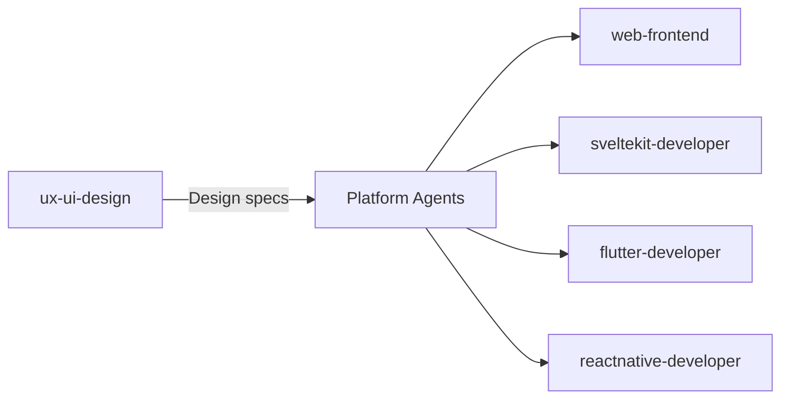
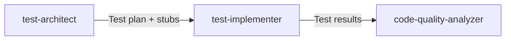
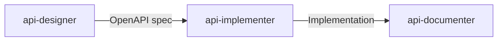

# Claude Sub-Agents Usage Guide

## Overview
This guide explains how to effectively use the specialized Claude sub-agents in the prometheus-agents project. Each agent has been designed with specific expertise to help with different aspects of software development.

## Quick Start

To use a sub-agent, reference it with the `@` symbol followed by the agent file path:
```
@agents/elixir-phoenix.md - for Elixir/Phoenix development
@agents/flutter-developer.md - for Flutter mobile apps
```

## Agent Categories & When to Use Them

### 1. Backend & Architecture Agents

#### **@agents/architecture-solutions.md**
- **When to use**: System design, choosing design patterns, creating architecture diagrams
- **Example tasks**:
  - "Design a microservices architecture for an e-commerce platform"
  - "Create C4 diagrams for our system"
  - "Write an ADR for choosing between REST and GraphQL"

#### **@agents/specifications-writer.md**
- **When to use**: Writing PRDs, technical specifications, translating architecture to implementation plans
- **Example tasks**:
  - "Write a PRD for the user profile feature"
  - "Create technical specification from the authentication architecture"
  - "Define acceptance criteria for the payment system"

#### **@agents/elixir-phoenix.md**
- **When to use**: Elixir/Phoenix development, Ash Framework resources, LiveView
- **Example tasks**:
  - "Create an Ash resource for user management"
  - "Implement real-time features with Phoenix LiveView"
  - "Set up an Ash API with authentication"

#### **@agents/data-architecture.md**
- **When to use**: Database design, data modeling, ETL pipelines
- **Example tasks**:
  - "Design a data warehouse schema"
  - "Create an ETL pipeline architecture"
  - "Model relationships using Ash resources"

#### **@agents/semantic-data.md**
- **When to use**: RDF, ontologies, semantic web, knowledge graphs
- **Example tasks**:
  - "Create an OWL ontology for our domain"
  - "Write SPARQL queries for our knowledge graph"
  - "Model our data using schema.org vocabulary"

### 2. UI/UX Development Agents

#### **@agents/ux-ui-design.md** (Master Coordinator)
- **When to use**: UI/UX design, wireframes, design systems, user research
- **Example tasks**:
  - "Design a user onboarding flow"
  - "Create a design system for our multi-platform app"
  - "Review and improve accessibility"

#### **@agents/web-frontend.md**
- **When to use**: HTML, JavaScript, TailwindCSS, Phoenix LiveView UI
- **Example tasks**:
  - "Create responsive components with TailwindCSS"
  - "Implement client-side interactivity"
  - "Build Phoenix LiveView components"

#### **@agents/sveltekit-developer.md**
- **When to use**: SvelteKit applications, Svelte components, SSR/SSG
- **Example tasks**:
  - "Create a SvelteKit app with authentication"
  - "Build reactive Svelte components"
  - "Implement server-side rendering"

#### **@agents/flutter-developer.md**
- **When to use**: Flutter mobile/web apps, GetX state management, Dart
- **Example tasks**:
  - "Build a Flutter app with GetX navigation"
  - "Implement GetX state management"
  - "Create custom Flutter widgets"

#### **@agents/reactnative-developer.md**
- **When to use**: React Native apps, cross-platform mobile, Expo
- **Example tasks**:
  - "Create a React Native app with Expo"
  - "Implement native modules"
  - "Build cross-platform components"

### 3. Testing & Quality Agents

#### **@agents/test-architect.md**
- **When to use**: Test planning, test strategy, creating test stubs
- **Example tasks**:
  - "Create a test plan for our Ash API"
  - "Design test strategy for Flutter app"
  - "Generate failing test stubs for TDD"

#### **@agents/test-implementer.md**
- **When to use**: Writing tests, implementing test stubs, test automation
- **Example tasks**:
  - "Implement ExUnit tests for Ash resources"
  - "Write Flutter widget tests"
  - "Create Jest tests for SvelteKit"

#### **@agents/code-quality-analyzer.md**
- **When to use**: Code analysis, fixing warnings, improving code quality
- **Example tasks**:
  - "Analyze and fix Credo warnings"
  - "Resolve TypeScript compiler errors"
  - "Fix Dart analyzer issues"

### 4. API Development Agents

#### **@agents/api-designer.md**
- **When to use**: API design, OpenAPI specs, REST principles
- **Example tasks**:
  - "Design REST API for user management"
  - "Create OpenAPI 3.0 specification"
  - "Design API versioning strategy"

#### **@agents/api-implementer.md**
- **When to use**: Phoenix API implementation, Ash resources, authentication
- **Example tasks**:
  - "Implement Ash JSON API endpoints"
  - "Add JWT authentication to Phoenix"
  - "Create Ash resource actions"

#### **@agents/api-documenter.md**
- **When to use**: API documentation, integration guides, examples
- **Example tasks**:
  - "Document our REST API endpoints"
  - "Create Postman collection"
  - "Write API integration guide"

### 5. Documentation Agents

#### **@agents/documentation-technical.md**
- **When to use**: Technical docs, README files, architecture documentation
- **Example tasks**:
  - "Write technical documentation for our system"
  - "Create developer onboarding guide"
  - "Document deployment process"

## Collaboration Workflows

### UI/UX Development Flow


1. Start with **@agents/ux-ui-design.md** for design
2. Hand off to platform-specific agents for implementation
3. Each platform agent follows the design system

### Testing Workflow


1. **@agents/test-architect.md** creates test plans and stubs
2. **@agents/test-implementer.md** implements the tests
3. **@agents/code-quality-analyzer.md** ensures code quality

### API Development Flow


1. **@agents/api-designer.md** creates API specifications
2. **@agents/api-implementer.md** builds with Ash Framework
3. **@agents/api-documenter.md** creates documentation

## Best Practices

### 1. Choose the Right Agent
- Be specific about which agent you need
- Use the master UX/UI agent for design coordination
- Use specialized agents for implementation

### 2. Provide Context
- Share relevant code or documentation
- Specify frameworks/libraries in use
- Mention any constraints or requirements

### 3. Chain Agents for Complex Tasks
Example flow for new feature:
```
1. @agents/architecture-solutions.md - Design the feature architecture
2. @agents/api-designer.md - Design the API
3. @agents/ux-ui-design.md - Create UI mockups
4. @agents/api-implementer.md - Build the backend
5. @agents/flutter-developer.md - Build mobile UI
6. @agents/test-architect.md - Create test plan
7. @agents/test-implementer.md - Write tests
8. @agents/documentation-technical.md - Document the feature
```

### 4. Leverage Agent Expertise
- Architecture agents understand patterns and trade-offs
- Platform agents know framework-specific best practices
- Test agents understand testing pyramids and strategies
- API agents follow REST principles and standards

## Technology-Specific Notes

### Ash Framework (Elixir/Phoenix)
- All Elixir agents use Ash Framework instead of Ecto
- Agents understand Ash resources, actions, and relationships
- API implementation follows Ash patterns

### Flutter with GetX
- Flutter agent is configured for GetX state management
- Understands GetX routing and dependency injection
- Follows GetX best practices and patterns

### Semantic Data
- Works with OWL, FOAF, and schema.org ontologies
- Can create and query RDF data
- Understands semantic web principles

## Troubleshooting

### Agent Not Responding as Expected?
1. Verify you're using the correct agent
2. Provide more specific context
3. Check if task needs multiple agents

### Need Multiple Perspectives?
- Use test-architect for planning, test-implementer for coding
- Use api-designer for specs, api-implementer for code
- Use ux-ui-design for design, platform agents for builds

### Complex Cross-Platform Project?
1. Start with architecture-solutions for overall design
2. Use ux-ui-design for consistent UI/UX
3. Deploy platform-specific agents in parallel
4. Coordinate with test agents for quality

## Examples

### Example 1: Building a New Feature
```
User: "I need to add user profiles to our app"

1. @agents/architecture-solutions.md - "Design the architecture for user profiles"
2. @agents/data-architecture.md - "Design the data model for profiles" 
3. @agents/api-designer.md - "Create OpenAPI spec for profile endpoints"
4. @agents/ux-ui-design.md - "Design the profile UI"
5. @agents/api-implementer.md - "Implement profile API with Ash"
6. @agents/flutter-developer.md - "Build profile screens with GetX"
```

### Example 2: Fixing Code Quality Issues
```
User: "Our Elixir code has many warnings"

1. @agents/code-quality-analyzer.md - "Analyze all Credo warnings"
2. @agents/elixir-phoenix.md - "Fix the critical warnings"
3. @agents/test-implementer.md - "Add tests for fixed code"
```

### Example 3: API Documentation
```
User: "We need to document our REST API"

1. @agents/api-documenter.md - "Create comprehensive API docs"
2. @agents/documentation-technical.md - "Write integration guides"
```

## Conclusion

The prometheus-agents provide specialized expertise across the full development stack. Use them individually for focused tasks or chain them together for complex workflows. Each agent has deep knowledge in their domain while understanding how to collaborate with other agents.

Remember: The right agent for the right task leads to better results!